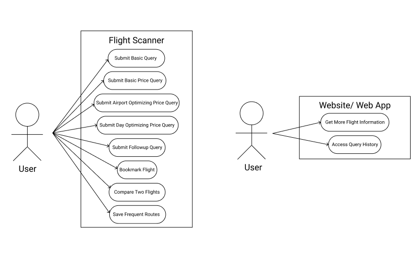

# Requirements

## Personas

### Justin K. Carter

**Age:** 44  
**Company:** EarthHard, Inc 
**Occupation:** Limnologist  
**Goal:** Book flight tickets for domestic and international flights to study inland water at different locations.  
**Challenge:** Has a very busy schedule between teaching and research so finding the time to sit down and go through lists of flights is difficult.  
**How We Help:** Allow Justin to select the most suitable flights through talking to Alexa while he showers, waters his plants, or stares at his water samples. 

### Isaac J. Young

**Age:** 18  
**Company:** Northview University  
**Occupation:** College Student  
**Goal:** Book flights to go home during Spring break  
**Challenge:** With the limited amount of money he made from tutoring Python, Isaac cannot afford the peak-time tickets but has to come back to school in time for classes.   
**How We Help:** Allow Isaac to keep track of the lowest price of flights in a range of time he specifies and update him during his casual conversation with Alexa. 

### Mary G. Loya

**Age:** 76  
**Company:** Planet Pizza  
**Occupation:** Training Specialist  
**Goal:** Book the earliest flights to Montana from Florida to see her granddaughter who is about to give birth to her great granddaughter.   
**Challenge:** Unfamiliar with web browser based flight searching technologies, but the matter is too urgent to wait until some comes to help.   
**How We Help:** Allow Mary to find the earliest flight to Montana by chatting with Alexa the way she would with a human. 

## Use Cases

### Basic Query (no specifications)

**Actor:** User  
**Scenario:** User asks Alexa to find a flight on a specific day from a specific airport to another specific airport. Alexa informs the user of any invalid requests and inquires further, or confirms the request. Alexa looks for a flight between the two airports and tells the user the price and time of the found flight. 

### Price Query

**Actor:** User  
**Scenario:** User asks Alexa for the cheapest flight on a specific day from a specific airport to another specific airport. Alexa informs the user of any invalid requests and inquires further, or confirms the request. Alexa looks at flights from and to the respective airports and finds the cheapest option. Alexa tells the user the price and time of the found flight.

### Airport Optimizing Price Query

**Actor:** User  
**Scenario:** User asks Alexa for the cheapest flight on a specific day from a specific or general location to another general location. Alexa informs the user of any invalid requests and inquires further, or confirms the request. Alexa looks at the two locations and searches the flights between various appropriate airports to find the cheapest possible option. Alexa tells the user the price, departure airport, and arrival airport of the found flight.

### Day Optimizing Price Query 

**Actor:** User  
**Scenario:** User asks Alexa for the cheapest flight within a range of dates from a specific airport to a specific airport. Alexa informs the user of any invalid requests and inquires further, or confirms the request. Alexa searches the flights to find the cheapest flight out of any of the dates in the range. Alexa tells the user the price, day, and time of the flight. 

### Get more Flight Information

**Actor:** User  
**Scenario:** User finishes a query and Alexa sends the information to the website. The User logs on to the website and is able to see all of the specifics about the flight including the airline, time, date, price, and a booking link.

### Access Query History

**Actor:** User  
**Scenario:** User finishes one or more queries resulting in Alexa sending multiple finished query outputs to the website. The User logs on to the website and is able to see the specifics about any previous flight query, including the airline, time, date, price, and a booking link.

### Followup Query

**Actor:** User  
**Scenario:** User receives flight information from previous query and adds new constraints or alters previous search conditions. Alexa fetches previous query, modify conditions, and search for flights. Alexa display results to user in desired format. 

### Bookmark Flight

**Actor:** User  
**Scenario:** User requests to bookmark a particular flight for booking or comparison with other flights and gives the flight a label. Alexa stores the reference to the flight in a buffer. Alexa confirms with the user that the flight is bookmarked under the label user specified. 

### Comparison

**Actor:** User  
**Scenario:** User provides references to two flights and criterias for comparison. Alexa fetch data on these flights, generates comparison results, and display them to the user. 

### Save Frequent Routes

**Actor:** User  
**Scenario:** User provides origin, destination, and label of a route. Alexa validates the input and confirms with user. Alexa stores the route. 

### Use Case Diagram

## Domain Model

