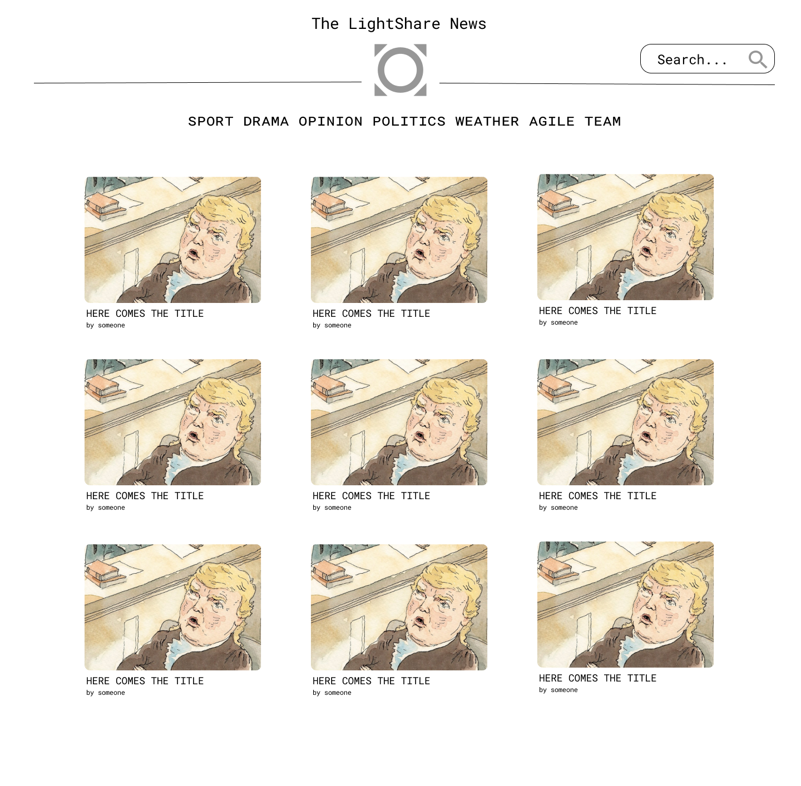
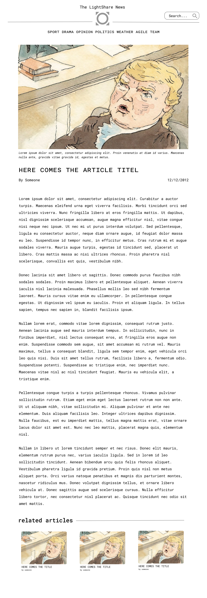
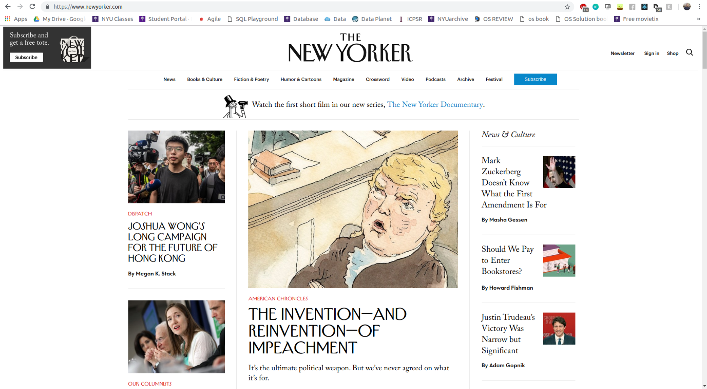

## Designs 
### Web-application 
Here is an overview of the desings and their development over time. The design prototypes have been created using Figma and the original workbench can be vistied [here](https://www.figma.com/file/zPjNBFtlZA3CFstcKnCYY2/Material-Baseline-Design-Kit?node-id=0%3A10)

First design for the landing page 
 

First design for article page 
 

First design for category page 
 

Inspiration for our initial approach was drawn from the [The New Yorker](https://www.newyorker.com/)
 
