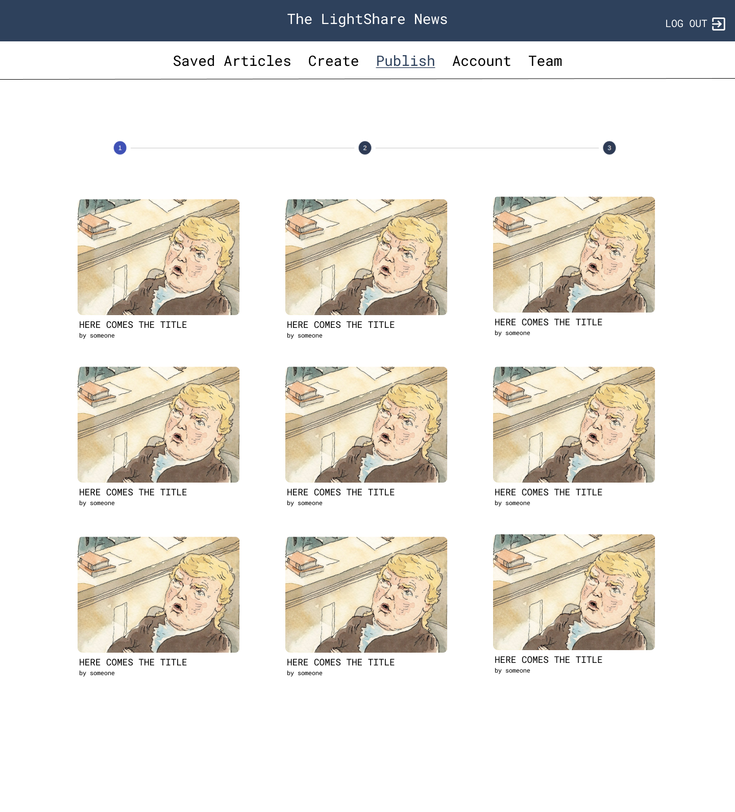
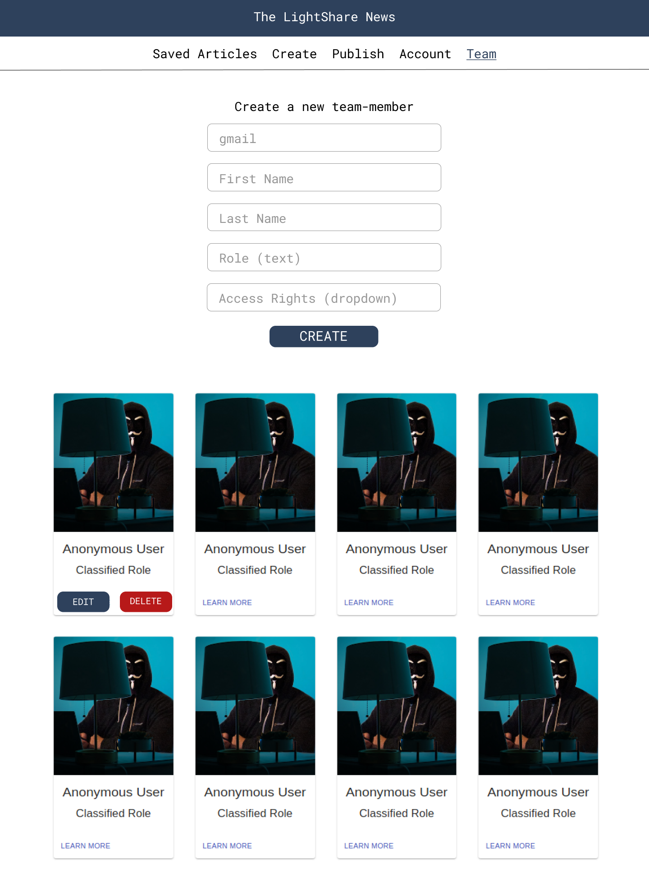
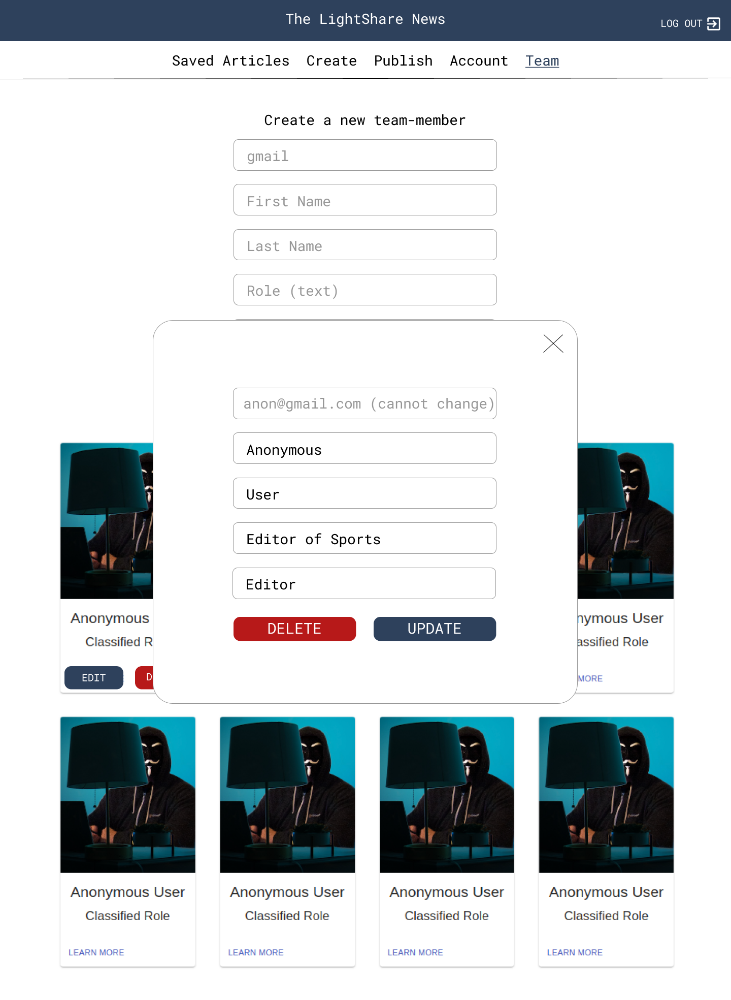

## Frontend designs 
### Web-application 
Here is an overview of the desings and their development over time. The design prototypes have been created using Figma and the original workbench can be visited [here](https://www.figma.com/file/zPjNBFtlZA3CFstcKnCYY2/Material-Baseline-Design-Kit?node-id=0%3A10)

First design for the landing page 
 

First design for article page 
 

First design for category page 
 

Current version of profile page

Current version of the Admin side Saved Articles page 

Current version of the Admin side Create page 

Current version of the Admin side Account page 

Current version of the Admin side Publishing page 

Current version of the Admin side Team Management page 

Inspiration for our initial approach was drawn from the [The New Yorker](https://www.newyorker.com/)
 
